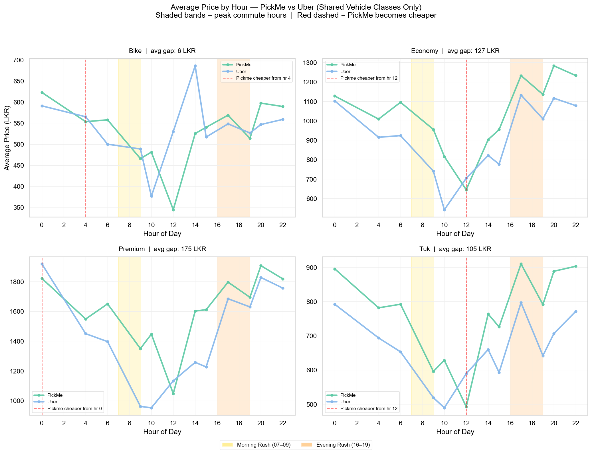
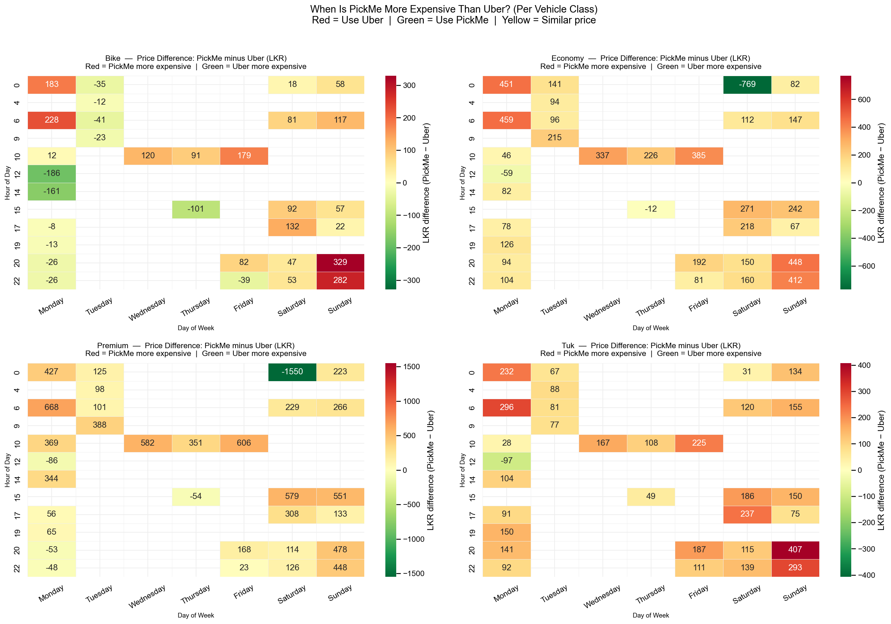
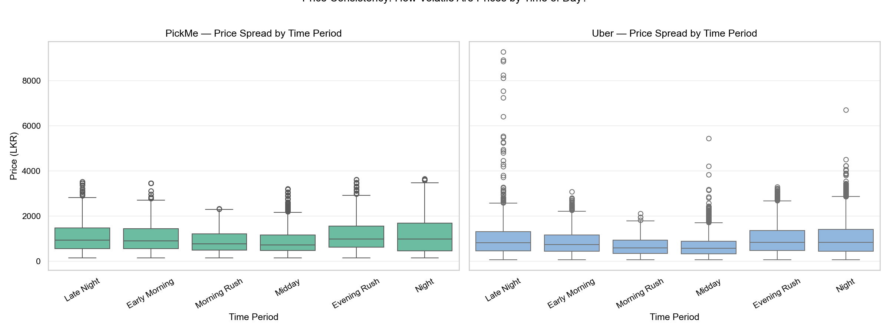
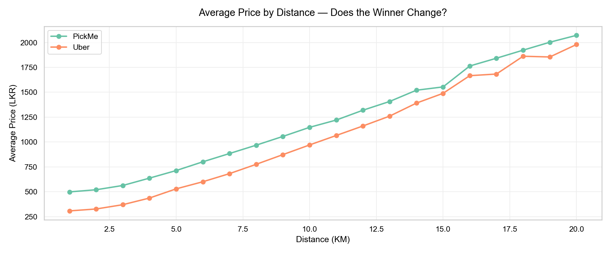

# 🚗 Ride-Hailing Price Comparison & Prediction Dashboard

> Comparing Uber and PickMe fares in the Sri Lanka market to help daily commuters make smarter, cheaper travel decisions.

---

## 📌 Project Overview

**Problem statement:**
A daily commuter needs to determine — given their trip distance, time of day, day of week, and preferred vehicle type — which ride-hailing platform (Uber or PickMe) offers the lowest fare, supported by historical pricing trends and a predictive model.

**Core question the dashboard answers:**
> *"For my trip right now — which platform should I open?"*

---

## 🗂️ Folder Structure

```
ride_analysis/
│
├── data/
│   ├── raw/                        ← original CSVs, READ ONLY, never modified
│   ├── processed/
│   │   ├── cleaned_rides.csv       ← detailed data for all dashboard charts
│   │   ├── summary_stats.csv       ← aggregated KPIs and platform comparisons
│   │   ├── predictions.csv         ← ML price prediction grid (30,240 rows)
│   │   └── .processed_log          ← tracks which files have been processed
│   └── models/
│       ├── model_pickme.pkl        ← trained GradientBoosting model (PickMe)
│       └── model_uber.pkl          ← trained RandomForest model (Uber)
│
├── src/
│   ├── config.py                   ← all settings, paths, and constants
│   ├── loader.py                   ← incremental CSV loading & schema validation
│   ├── cleaner.py                  ← all data cleaning logic
│   ├── model.py                    ← ML model training, evaluation, and export
│   ├── export.py                   ← exports processed CSVs for Power BI
│   └── main.py                     ← pipeline entry point
│
├── notebooks/
│   └── 01_eda.ipynb                ← exploratory analysis (not production code)
│
├── powerbi/
│   └── dashboard.pbix              ← Power BI dashboard file
│
├── .env                            ← local paths/secrets (never committed)
├── .gitignore
├── requirements.txt
└── README.md
```

---

## ⚙️ Setup

### Prerequisites

- Python 3.10+
- Git
- Power BI Desktop (for dashboard)

### Installation

```bash
# 1. Clone the repository
git clone <repo-url>
cd ride_analysis

# 2. Create and activate virtual environment
python -m venv venv
source venv/bin/activate        # macOS/Linux
venv\Scripts\activate           # Windows

# 3. Install dependencies
pip install -r requirements.txt

# 4. Configure environment
cp .env.example .env
# Edit .env with your local data paths
```

### Environment Variables (`.env`)

```env
RAW_DATA_DIR=data/raw
PROCESSED_DATA_DIR=data/processed
MODELS_DIR=data/models
LOG_LEVEL=INFO
```

---

## 🔄 Running the Pipeline

```bash
# Full pipeline: load → clean → export → retrain models → export predictions
python src/main.py

# Individual stages
python src/main.py --stage load        # load new CSVs only
python src/main.py --stage clean       # clean and reshape data
python src/main.py --stage export      # export processed CSVs
python src/main.py --stage model       # retrain ML models + export predictions
```

**The pipeline is incremental** — it tracks which files have been processed via `.processed_log` and only processes new CSVs. Safe to run daily as new data arrives.

---

## 📊 Data Schema

### Input: CSV Filename Format

```
OutputUber_A_To_B_2026-04-27_00-00-00.csv        ← 24-hour format (legacy)
OutputPickMe_Gampaha_2026-05-04_12-52-28 PM.csv  ← 12-hour format (current)
```

Parsed fields: `platform`, `route_group`, `capture_date`, `capture_time` (normalised to 24-hour).

### Input: Price Column Logic (v2 schema — from 2026-05-04)

```
Price = original listed price
Dis   = discounted price (or 0 if no discount applies)

If Dis > 0  → customer pays Dis;  saving = Price − Dis
If Dis = 0  → customer pays Price; no discount
```

### Output: `cleaned_rides.csv` Schema

| Column | Type | Description |
|--------|------|-------------|
| `Distance(KM)` | float | Trip distance |
| `Pickup Location` | string | Zone name |
| `Drop Location` | string | Zone name |
| `datetime` | datetime | Derived from filename |
| `hour` | int | 0–23 |
| `day_of_week` | int | 0 = Monday, 6 = Sunday |
| `day_name` | string | Monday–Sunday |
| `is_weekend` | bool | True for Saturday/Sunday |
| `time_period` | string | Late Night / Early Morning / Morning Rush / Midday / Evening Rush / Night |
| `route_group` | string | e.g. `A_To_B`, `ColomboSouth_Dehiwala` |
| `platform` | string | `PickMe` or `Uber` |
| `vehicle_class` | string | Bike / Tuk / Economy / Standard / Premium / Parcel_Bike / Parcel_Tuk |
| `price` | float | Actual amount customer pays (post-discount) |
| `is_discounted` | bool | Whether a discount was applied |
| `discount_amt` | float | LKR saved from discount |

---

## 🚗 Vehicle Class Mapping

| Unified Class | PickMe | Uber |
|---------------|--------|------|
| Bike | pickmeBike | uberMoto |
| Tuk | pickmeTuk | uberTuk |
| Economy | pickmeFlex | uberZip |
| Standard | pickmeMini | *(PickMe only)* |
| Premium | pickmeCar | uberPremier |
| Parcel_Bike | pickmeFlash | uberParcel_Bike |
| Parcel_Tuk | pickmeFlashL | uberParcel_Tuk |

**Shared classes** (used in commuter-facing comparisons): Bike, Tuk, Economy, Premium

---

## ⏰ Time Period Definitions

| Period | Hours |
|--------|-------|
| Late Night | 00:00 – 04:59 |
| Early Morning | 05:00 – 06:59 |
| Morning Rush ⚡ | 07:00 – 09:59 |
| Midday | 10:00 – 15:59 |
| Evening Rush ⚡ | 16:00 – 19:59 |
| Night | 20:00 – 23:59 |

---

## 🤖 ML Prediction Model

Three algorithms were evaluated per platform. Models were trained on an 80/20 train/test split (`random_state=42`).

**Features used:** `Distance(KM)`, `hour`, `day_of_week`, `vehicle_class`, `time_period`

### Model Selection Results

| Platform | Algorithm | RMSE | MAE | R² | **Selected** |
|----------|-----------|------|-----|----|-------------|
| PickMe | Linear Regression | — | — | — | |
| PickMe | Random Forest | — | — | — | |
| PickMe | **Gradient Boosting** | **93 LKR** | **50 LKR** | **0.9762** | ✅ |
| Uber | Linear Regression | — | — | — | |
| Uber | **Random Forest** | **189 LKR** | **127 LKR** | **0.9104** | ✅ |
| Uber | Gradient Boosting | — | — | — | |

> **Model selection logic:** Best RMSE and R² combination per platform. Each platform's winner was selected independently.

### Prediction Grid

`predictions.csv` contains **30,240 rows** covering all combinations of:
- Distance: 1–20 km (integer steps)
- Hour: 0–23
- Day of week: 0–6 (Mon–Sun)
- Vehicle class: all non-parcel classes

> ⚠️ *"Prices estimated from historical data. Actual fares may differ due to surge pricing or promotions."*

---

## 📈 Key EDA Findings

These findings directly informed dashboard design decisions and filter priority order.

1. **Weekend vs Weekday is the strongest predictor** — PickMe is generally cheaper on weekdays; Uber is cheaper on weekends. This is the first filter in the dashboard.

2. **Distance crossover at ~3–4 km** — PickMe tends to win under 3 km; Uber tends to win over 4 km across most vehicle classes.

3. **Vehicle class matters significantly** — Economy and Premium favour Uber; Bike favours PickMe for short trips.

4. **Wednesday 09:00–13:00 anomaly** — Uber prices are significantly elevated during this window. Possible recurring demand spike. Warrants ongoing monitoring as data grows.

5. **Uber has far more extreme price outliers** — spikes up to 10,500 LKR observed. PickMe pricing is considerably more predictable (see box plot analysis).

6. **Simpson's Paradox caught and resolved** — PickMe appeared more expensive overall due to the Standard vehicle class (PickMe-only) inflating the platform average. All fair comparisons use shared vehicle classes only.

---

## 📊 EDA Charts Summary

### Chart 1 — Average Price by Hour (per Vehicle Class)



Four-panel line chart comparing PickMe and Uber average prices hour by hour for each shared vehicle class (Bike, Economy, Premium, Tuk). Shaded bands mark Morning Rush (07–09) and Evening Rush (16–19).

**Key observations (pending confirmation as dataset grows):**
- Premium: Uber cheaper all day — largest gap (avg 175 LKR). PickMe becomes cheaper from hour 0 (overnight).
- Economy: Uber cheaper with avg 127 LKR gap. PickMe flips cheaper from hour 12 midday onwards.
- Tuk: Uber cheaper on average (105 LKR gap). PickMe flips near hour 12.
- Bike: Tightest competition — avg gap only 6 LKR. PickMe becomes cheaper from hour 4 onward.

---

### Chart 2 — Price Difference Heatmap (Hour × Day of Week, per Vehicle Class)



Four heatmaps showing the LKR difference (PickMe minus Uber) per hour and day of week.
- **Red** = PickMe more expensive → use Uber
- **Green** = Uber more expensive → use PickMe
- **Yellow** = Similar price → either platform

**Key observations (pending confirmation as dataset grows):**
- Many cells are blank — data collection is still ongoing. Observations will become reliable once sufficient coverage exists across all hour/day combinations.
- Weekend (Saturday/Sunday) shows the strongest and most consistent signals.
- Wednesday mid-morning shows notably high Uber prices across Economy and Premium (the Wednesday anomaly).
- Premium class has the widest absolute LKR swings — one Economy cell shows Uber 1,550 LKR cheaper (possible outlier; needs monitoring).

---

### Chart 3 — Price Spread Box Plot (Volatility by Time Period)



Side-by-side box plots comparing price spread for PickMe (green) and Uber (blue) across the six time periods.

**Key observations (pending confirmation as dataset grows):**
- Uber has dramatically more extreme outliers in every time period — most visible in Late Night and Early Morning where individual fares exceed 9,000 LKR.
- PickMe's interquartile range is consistently tighter — more predictable pricing behaviour.
- Both platforms show similar median prices; the difference lies in variance, not central tendency.
- Commuters who prioritise price certainty (not just average cost) should factor in Uber's higher volatility risk.

---

### Chart 4 — Average Price by Distance (Platform Winner by Distance)



Single line chart showing average price across all vehicle classes from 1 to 20 km.

**Key observations (pending confirmation as dataset grows):**
- Uber is consistently cheaper than PickMe across the entire 1–20 km range when aggregating all vehicle classes.
- The gap is relatively stable — Uber does not become proportionally more expensive at longer distances.
- Note: this chart mixes vehicle classes. When filtered to individual vehicle classes, the crossover point shifts (e.g. Bike class narrows significantly).
- The "PickMe cheaper under 3–4 km" finding applies within specific vehicle classes and time windows, not in raw aggregate.

---

> **⚠️ Data sufficiency note:** Charts 2 and 4 in particular have sparse coverage in some cells and distance/hour combinations. Observations labelled above are directional and should be treated as preliminary. A minimum of 4–6 weeks of continuous daily data collection is recommended before drawing firm conclusions or publishing the dashboard externally.

---

## 📊 Power BI Dashboard

### Pages

| Page | Content |
|------|---------|
| **Overview** | KPI cards: avg price, cheapest platform, total rides, date range |
| **Time Analysis** | Heatmap (hour × day), line chart by time period |
| **Platform Comparison** | Shared vehicle classes only, price per km, distance crossover |
| **Price Predictor** | Slicer-driven: distance + vehicle + day type → recommended platform + estimated price |
| **Data Quality** | Row counts, date coverage, null rates |

### Color Scheme

| Platform | Color | Hex |
|----------|-------|-----|
| PickMe | Green | `#5DCAA5` |
| Uber | Blue | `#85B7EB` |

### Filter Priority Order

```
Weekday / Weekend  →  Vehicle Class  →  Distance  →  Time of Day
```

### Files Loaded into Power BI

| File | Used for |
|------|---------|
| `cleaned_rides.csv` | All detailed charts and filters |
| `summary_stats.csv` | KPI cards and aggregated visuals |
| `predictions.csv` | Price Predictor page lookup table |

---

## 🔐 Security & Best Practices

- Raw CSVs in `data/raw/` are read-only — never mutated by the pipeline
- No PII stored; locations are treated as aggregated zone labels
- All inputs validated against schema on load; malformed files are logged and skipped
- Price outliers are capped before model training
- `.env` holds all configurable paths — never hardcoded
- `data/`, `.env`, `__pycache__`, `*.pyc`, `*.csv`, and `data/models/` are all in `.gitignore`
- Trained model `.pkl` files are never committed to version control
- Logging via Python `logging` module — no sensitive data in `print()` statements

---

## 📦 Dependencies

```
pandas>=2.0.0
numpy>=1.24.0
scikit-learn>=1.3.0
matplotlib>=3.7.0
seaborn>=0.12.0
python-dotenv>=1.0.0
openpyxl>=3.1.0
pytest>=7.4.0
```

---

## 🗺️ Project Roadmap

| Phase | Description | Status                                                       |
|-------|-------------|--------------------------------------------------------------|
| 1 | Discovery & requirements | ✅ Complete                                                   |
| 2 | Project setup (Python, Git, venv) | ✅ Complete                                                   |
| 3 | Data audit & cleaning pipeline | ✅ Complete                                                   |
| 4 | Exploratory data analysis | ✅ Complete (Need more data before giving proper Observation) |
| 5 | Feature engineering & ML models | ✅ Complete                                                   |
| 6 | Power BI dashboard | ⏳ In progress                                                |

---

## 📝 Notes

- Standard vehicle class is PickMe-only — excluded from all cross-platform comparisons
- Parcel classes (`Parcel_Bike`, `Parcel_Tuk`) are excluded from all commuter-facing dashboard pages
- The pipeline is designed for ongoing daily data ingestion — simply drop new CSVs into `data/raw/` and re-run `main.py`
